# 🧪 Hands-on Lab: Secure VM Access with Azure Bastion

### Why this matters
In cloud environments, administrative access to virtual machines should not be exposed directly to the public internet. Opening SSH or RDP ports publicly increases the attack surface and can expose workloads to brute-force attempts, scanning, and unauthorized access attempts.

Azure Bastion provides secure browser-based access to virtual machines through the Azure Portal without requiring a public IP address on the VM. This approach is especially useful in banking or regulated environments where secure administration, network segmentation, and reduced exposure are important security requirements.

---

### Objectives
- Create a dedicated Resource Group for the lab
- Deploy a Virtual Network with segmented subnets
- Create a private Linux VM without a public IP address
- Configure the VM with no public inbound ports
- Deploy Azure Bastion in the required `AzureBastionSubnet`
- Connect to the VM securely using Azure Bastion
- Validate SSH access from the Bastion subnet
- Confirm that administrative access is not exposed directly to the internet

---

### Environment
- Cloud Provider: Microsoft Azure
- Region: East US
- Operating System: Ubuntu Server 24.04 LTS
- Primary Services:
    - Azure Virtual Machines
    - Azure Virtual Network
    - Azure Bastion
    - Network Security Group
- Access Method:
    - Azure Bastion
    - SSH private key authentication

---

### Lab Steps (Summary)
1. Create the Resource Group
2. Create a Virtual Network for the lab
3. Create the workload subnet for the VM
4. Create the required `AzureBastionSubnet`
5. Deploy an Ubuntu Linux VM into `snet-workload`
6. Configure the VM without a public IP address
7. Disable public inbound ports
8. Deploy Azure Bastion in the same Virtual Network
9. Connect to the VM using Bastion and SSH private key authentication
10. Validate the Linux system, network configuration, SSH service, and access path
11. Review the Resource Visualizer to confirm the deployed architecture

---

### Evidence (Screenshots)
| Step | Screenshot |
|------|------------|
| Resource Group overview | 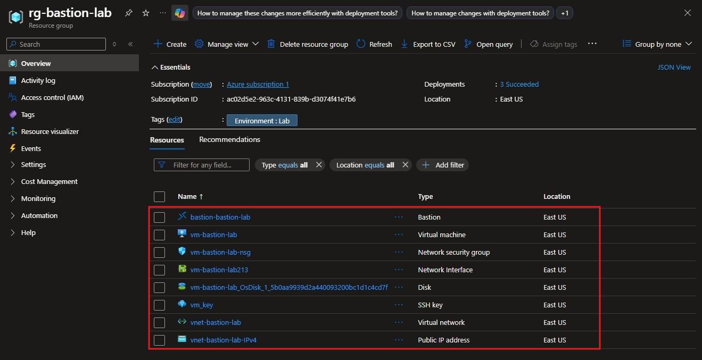 |
| Virtual Network Subnets | 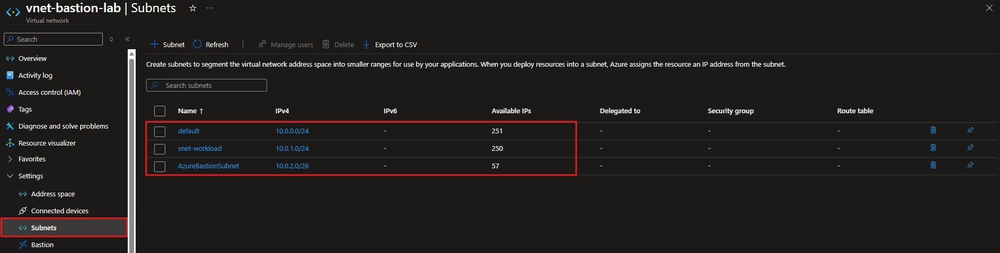 |
| VM overview | 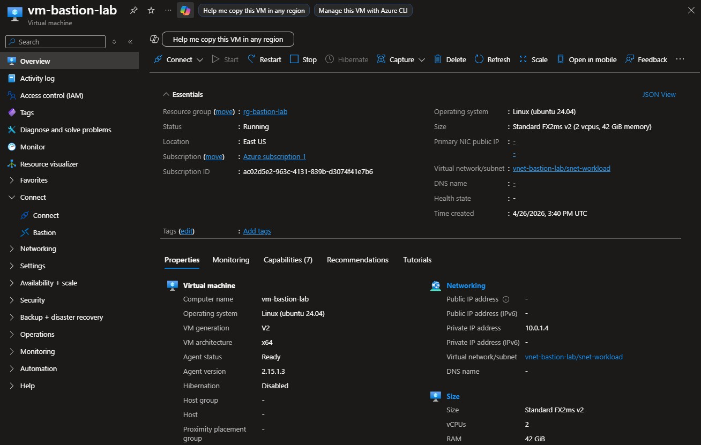 |
| VM network settings | 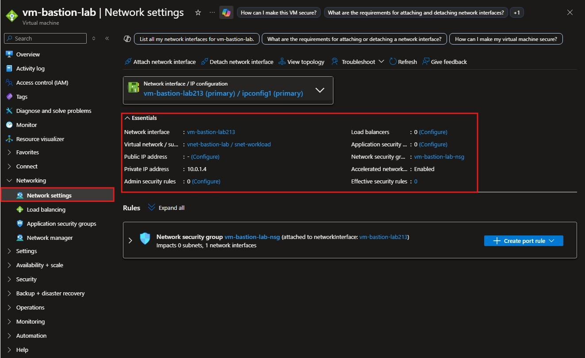 |
| NSG inbount rules | 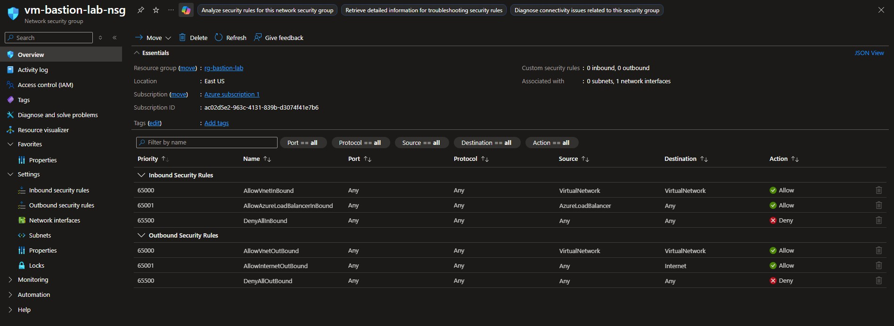 |
| Azure Bastion overview | 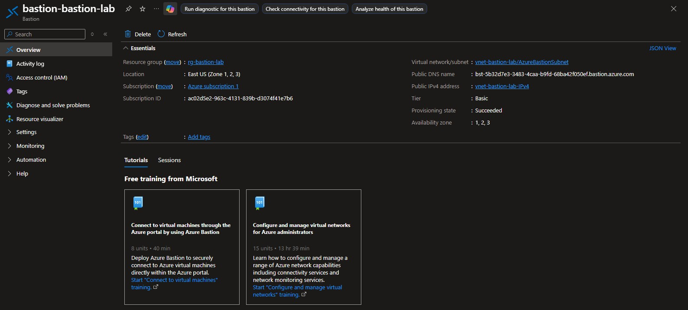 |
| Bastion connection screen | 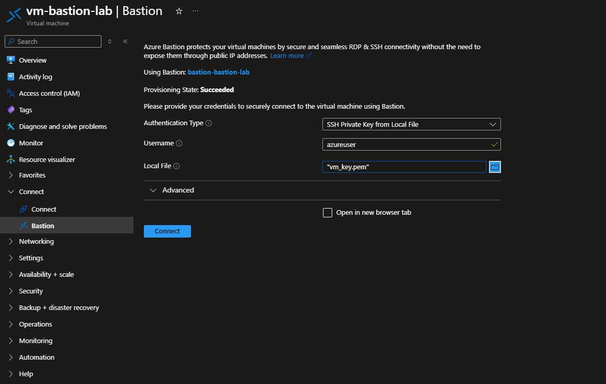 |
| Bastion terminal session | 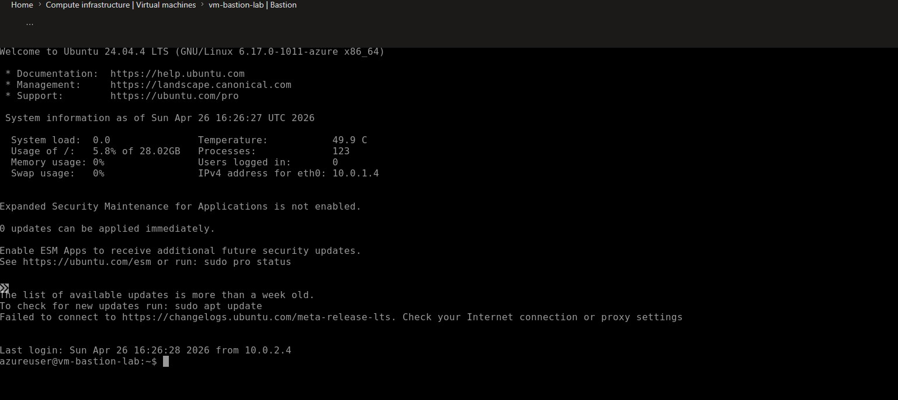 |
| Basic system validation | 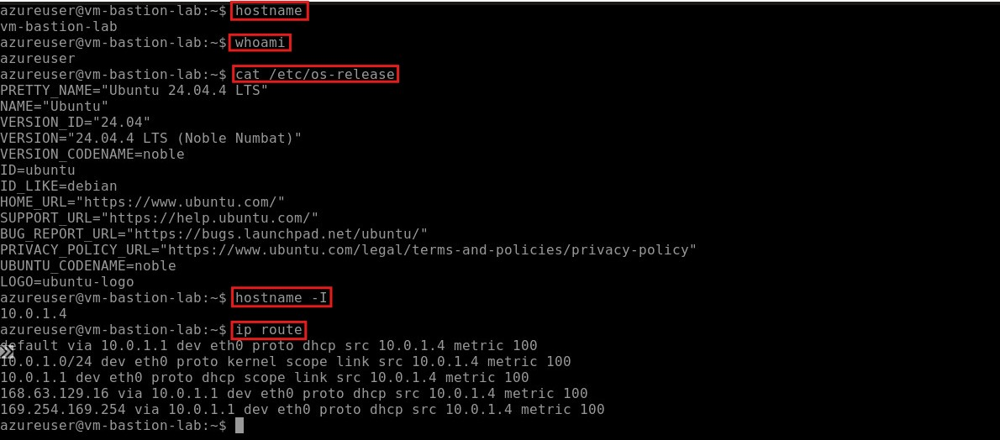 |
| SSH service validation | 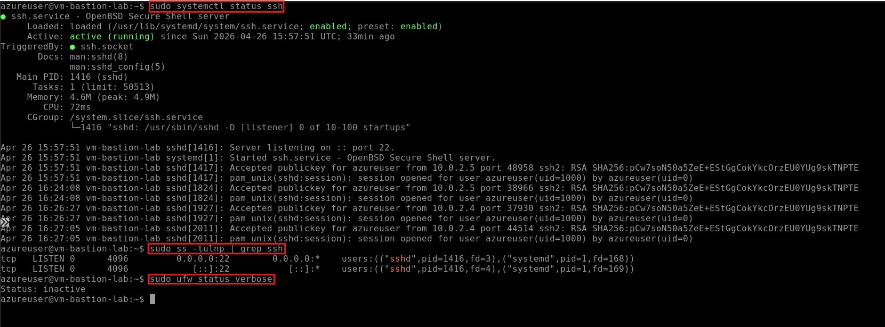 |
| Resource Visualizer | 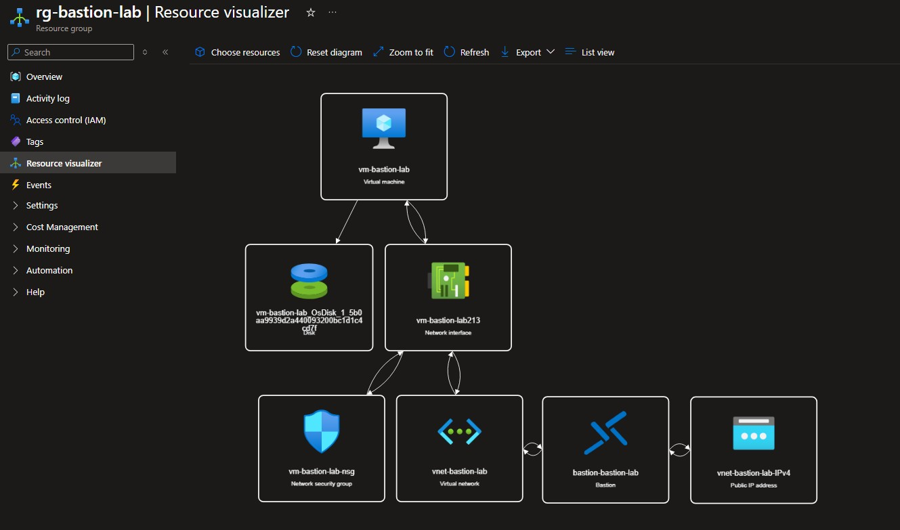 |

---

### Validation Commands
```bash
hostname                         # Shows the VM hostname to confirm the session is connected to the correct machine
whoami                           # Shows the current logged-in user
cat /etc/os-release              # Displays the Ubuntu version and OS details
hostname -I                      # Shows the private IP address assigned to the VM
ip route                         # Displays the VM routing table and default gateway

sudo systemctl status ssh        # Confirms that the OpenSSH service is running and shows recent SSH session logs
sudo ss -tulnp | grep ssh        # Shows that SSH is listening internally on port 22
sudo ufw status verbose          # Displays the Ubuntu firewall status

ping -c 4 8.8.8.8               # Tests ICMP connectivity to an external IP address
```

---

### key Takeaways
- Azure Bastion allows secure administrative access without exposing VMs publicly
- Removing public IP addresses from VMs reduces the attack surface
- Disabling public inbound ports helps prevent direct SSH exposure
- A dedicated AzureBastionSubnet is required for Bastion deployment
- NSG rules should avoid allowing SSH or RDP from Any
- Bastion is useful for cloud environments that require controlled administrative access
- This access model is relevant for banking and regulated sectors where secure remote administration is important