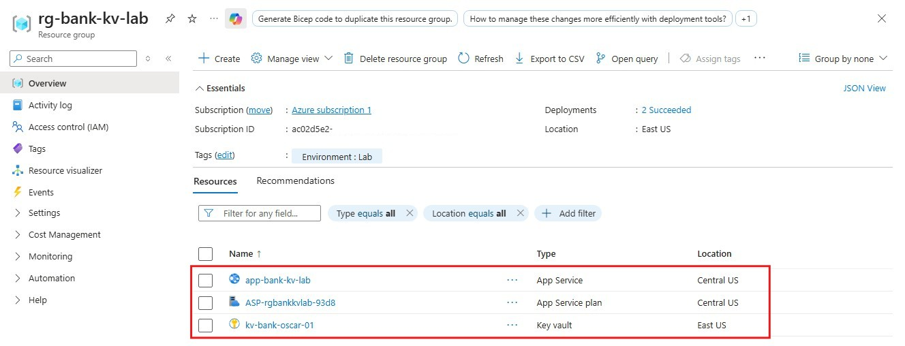
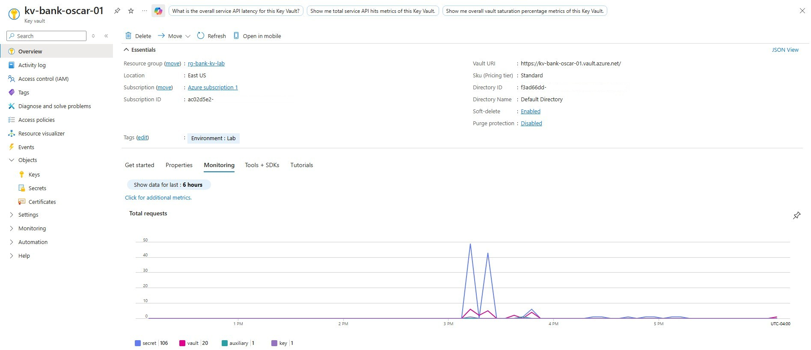
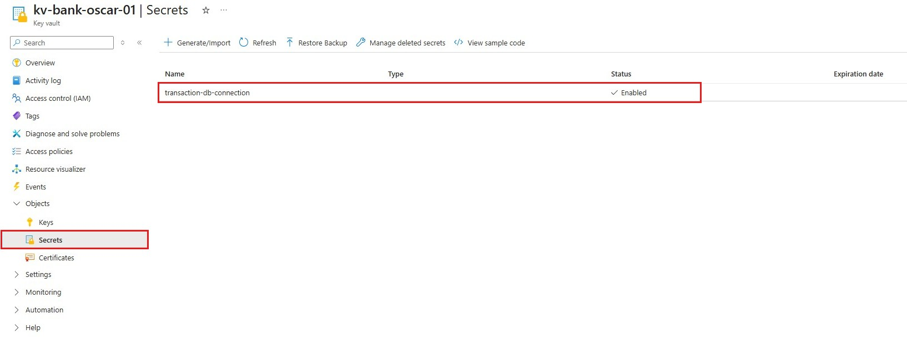
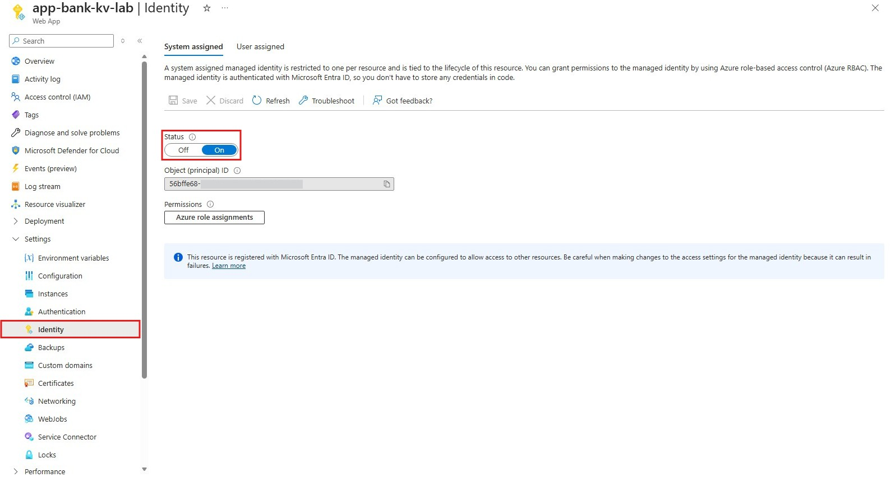
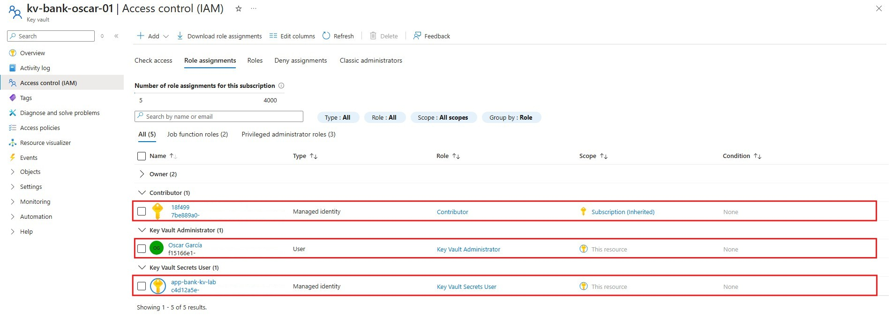
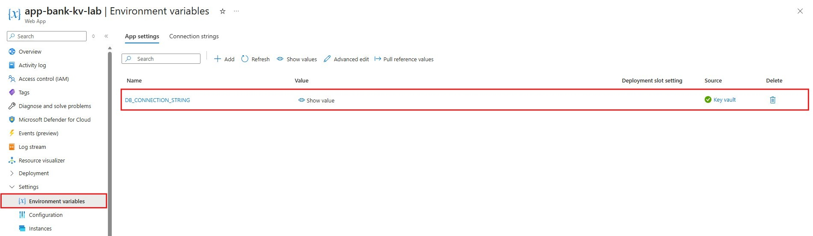
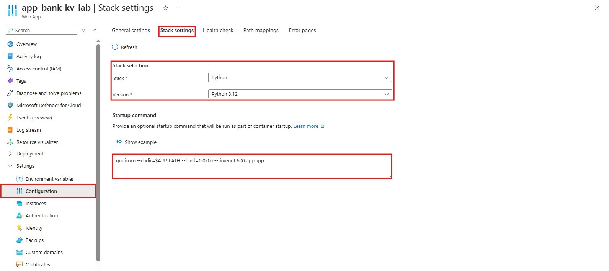
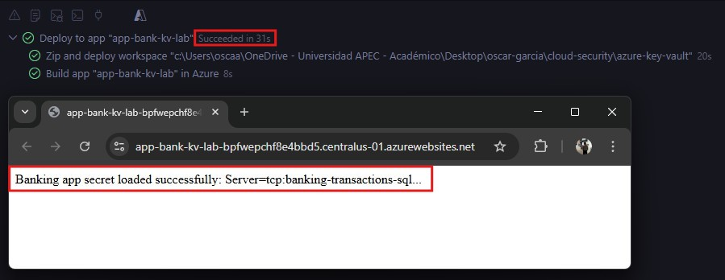

# 🧪 Hands-on Lab: Azure Key Vault + Managed Identity for Internal Banking App Configuration

### Why this matters (Cloud Security)
In cloud environments, sensitive application secrets such as connection strings should not be stored directly in source code, configuration files, or deployment pipelines.

In banking or regulated sectors, this creates unnecessary exposure and increases the risk of credential leakage. A more secure approach is to centralize secrets in **Azure Key Vault** and allow applications to retrieve them securely at runtime using **Managed Identity** and **RBAC**.

This lab demonstrates a practical governance and security pattern where an internal banking application reads a secret from Azure Key Vault without hardcoding credentials.

---
### Objectives
- Create a secure secret storage pattern in Azure
- Store a database connection string in Azure Key Vault
- Enable **System-assigned Managed Identity** on Azure App Service
- Grant the application secure read access to Key Vault using **RBAC**
- Configure the application to consume the secret through an App Setting
- Deploy a Python web application to Azure App Service
- Validate that the application reads the secret successfully at runtime

---
### Environment
- Cloud Provider: Microsoft Azure
- Region:
  - Key Vault: East US
  - App Service: Central US
- Scope: Resource Group
- Primary Services:
  - Azure Key Vault
  - Azure App Service
  - Azure Managed Identity
  - Azure RBAC
- Runtime:
  - Python 3.12
  - Flask
  - Gunicorn

---
### Lab Steps (Summary)
1. Create the **Resource Group**
2. Create the **Azure Key Vault**
3. Create a secret:
   - `transaction-db-connection`
4. Create the **Azure App Service**
5. Enable **System-assigned Managed Identity**
6. Assign the **Key Vault Secrets User** role to the App Service identity
7. Configure the App Setting:
   - `DB_CONNECTION_STRING`
8. Deploy the Python application
9. Configure the startup command
10. Validate that the application reads the secret successfully

---
### Evidence (Screenshots)
| Step | Screenshot |
|------|------------|
| Resource Group overview |  |
| Key Vault overview |  |
| Secret created in Key Vault |  |
| Managed Identity enabled |  |
| RBAC role assignment: Key Vault Secrets User |  |
| App Setting with Key Vault reference |  |
| Startup command configuration |  |
| Successful deployment and working result |  |

---
### Secret Management Pattern
The application uses the following secure access flow:
1. The database connection string is stored as a secret in Azure Key Vault
2. The App Service has System-assigned Managed Identity enabled
3. The managed identity is granted Key Vault Secrets User permissions
4. The application references the secret through an App Setting
5. The application reads the value at runtime without hardcoding it
>This pattern improves secret handling and reduces credential exposure in cloud-hosted applications.

---
### App Setting Configuration
The following App Setting was configured in Azure App Service:
```text
DB_CONNECTION_STRING = @Microsoft.KeyVault(SecretUri=https://kv-bank-oscar-01.vault.azure.net/secrets/transaction-db-connection)
```
This allowed the application to access the Key Vault secret securely through Azure configuration.

---
### Startup Command
The following startup command was required in Azure App Service:
```text
gunicorn --chdir=$APP_PATH --bind=0.0.0.0 --timeout 600 app:app
```

---
### Key Takeaways
- Azure Key Vault is a practical solution for centralizing sensitive application secrets
- Managed Identity removes the need to store credentials in code
- RBAC allows secure, controlled access to secrets
- App Service can consume Key Vault references through App Settings
- Startup configuration in Azure App Service can be critical for successful deployment
- This is a realistic security pattern for internal banking or regulated applications