# 🧪 Hands-on Lab: Secure Web Server Deployment on RHEL

### Why this matters (Systems Hardening / Security)
Deploying a web server without basic hardening introduces unnecessary risk. In enterprise environments, especially those influenced by security and compliance requirements, Linux servers should be deployed with controlled administrative access, restricted network exposure, service validation, and proper logging.

This lab demonstrates a basic but security-conscious deployment of a web server on RHEL, applying controls that help reduce attack surface and improve operational visibility.

---

### Objectives
- Validate the RHEL server environment
- Create a dedicated administrative user with sudo privileges
- Validate SSH remote access
- Disable direct root login over SSH
- Verify SELinux is running in enforcing mode
- Restrict allowed services through `firewalld`
- Install and validate an Nginx web server
- Confirm local and browser-based access to the hosted page
- Review Nginx access and error logs
- Validate time synchronization with Chrony

---

### Environment
- OS: Red Hat Enterprise Linux 9.7
- Hypervisor: VMware
- Web Server: Nginx
- Remote Access: OpenSSH
- Firewall: `firewalld`
- MAC Control: SELinux
- Time Sync Service: Chrony

---

### Lab Steps (Summary)
1. Validate system information and sudo access
2. Update the system
3. Create a dedicated administrative user
4. Validate SSH service and administrative login
5. Review SSH configuration and disable direct root login
6. Verify SELinux is in enforcing mode
7. Enable and configure `firewalld`
8. Install and start Nginx
9. Validate local web access with `curl`
10. Validate browser-based access using the server IP
11. Review Nginx access and error logs
12. Validate Chrony service and NTP synchronization

---

### Evidence (Screenshots)
| Step | Screenshot |
|------|------------|
| System information | 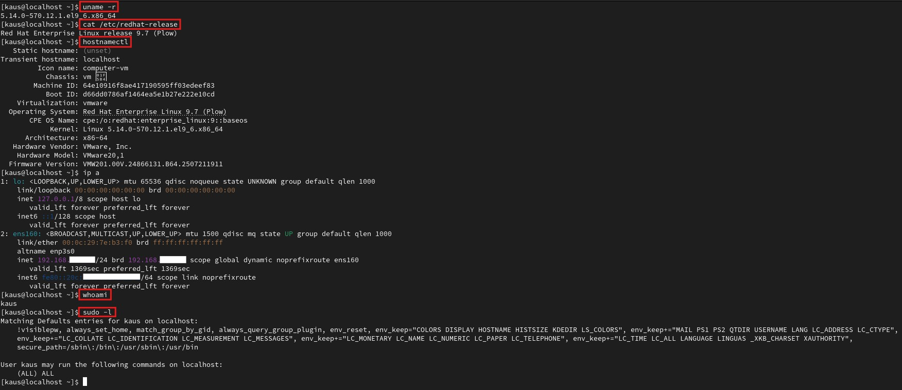 |
| System update | 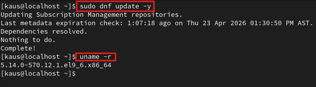 |
| Administrative user creation and sudo validation | 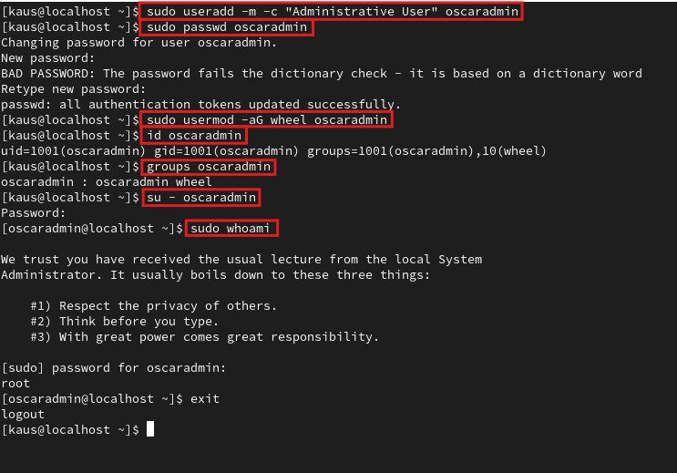 |
| SSH service status and IP configuration | 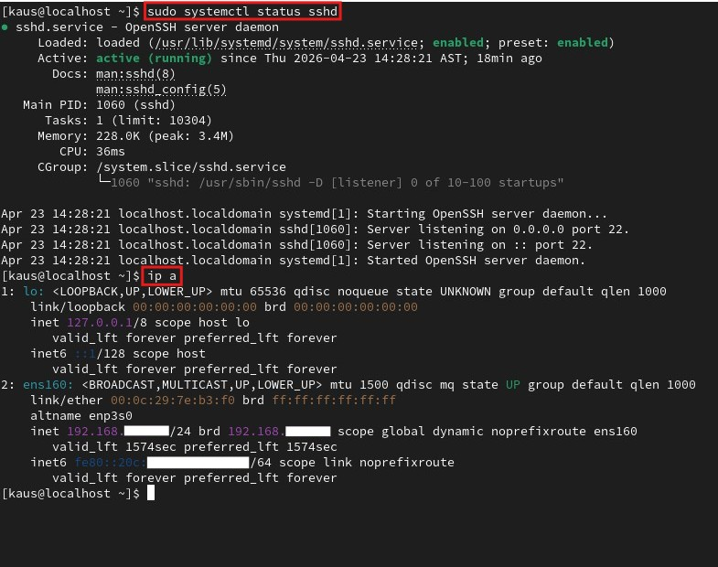 |
| SSH login validation | 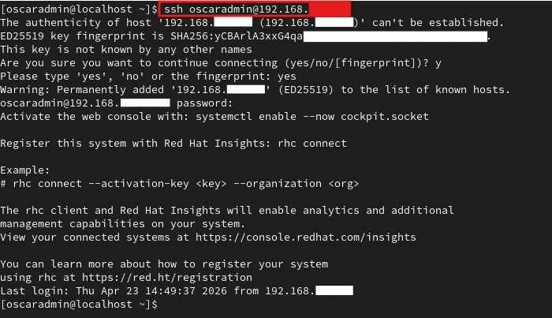 |
| SSH configuration validation | 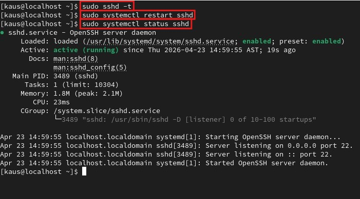 |
| SELinux enforcing status | 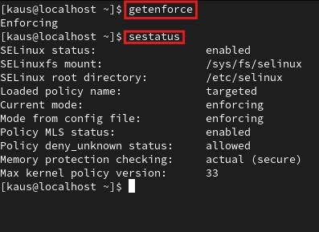 |
| `firewalld` active rules | 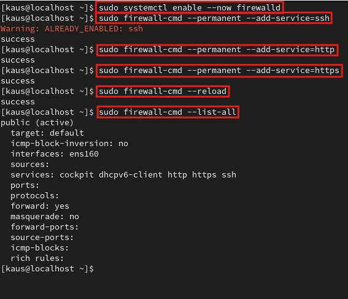 |
| Nginx service running | 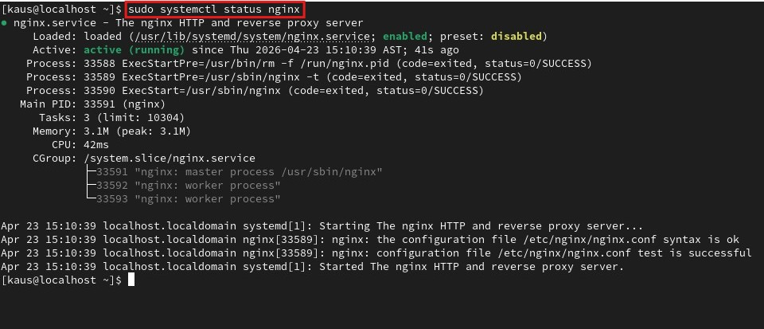 |
| Local web test with `curl` | 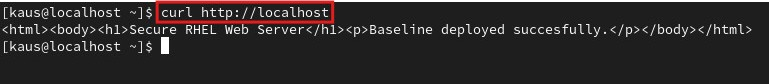 |
| Browser-based web access | 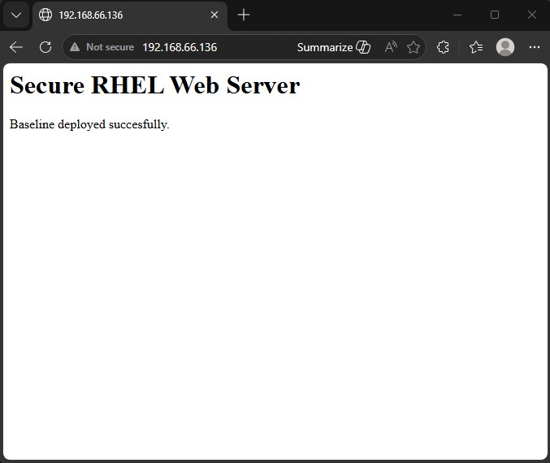 |
| Nginx access and error logs | 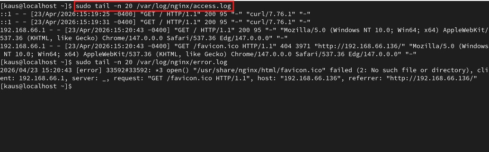 |
| Chrony service status | 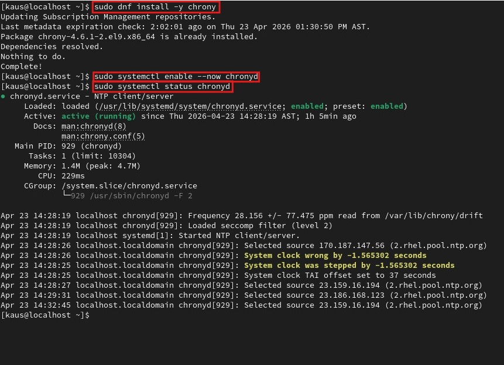 |
| Chrony tracking and sources | 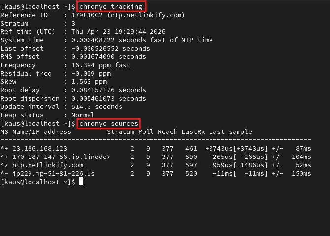 |

---

### Administrative Access Validation
```bash
su - oscaradmin
sudo whoami
ssh oscaradmin@IP_SERVER
```

---
### SSH Configuration
Confirmed setting:
- `PermitRootLogin no`
- `PasswordAuthentication yes`

This means:
- Direct root login over SSH was disabled
- Administrative SSH access remained available through a named account using password authentication

---
### Firewall Configuration
Allowed services configured with `Firewalld`:
- `ssh`
- `http`
- `https`
This helped keep exposure limited to the services required for remote administration and web access.

---
### Validation Commands
```bash
uname -r                    # Shows the active kernel version
cat /etc/redhat-release     # Displays the installed RHEL release version
hostnamectl                 # Shows hostname, OS details, kernel, architecture, and virtualization info
ip a                        # Displays network interfaces and assigned IP addresses
whoami                      # Shows the current logged-in user
sudo -l                     # Lists the sudo privileges available for the current user

id oscaradmin               # Displays UID, GID, and group membership for the administrative user
groups oscaradmin           # Shows the groups assigned to oscaradmin
sudo systemctl status sshd  # Confirms that the OpenSSH service is installed and running
sudo sshd -t                # Validates SSH configuration syntax before restarting the service
getenforce                   # Shows the current SELinux mode
sestatus                    # Displays detailed SELinux status and policy information

sudo firewall-cmd --list-all    # Shows active firewalld rules, services, and interface bindings
sudo systemctl status nginx     # Confirms that the Nginx service is installed and running
curl http://localhost           # Tests local HTTP access to the hosted web pages

sudo tail -n 20 /var/log/nginx/access.log   # Shows the most recent Nginx access log entries
sudo tail -n 20 /var/log/nginx/error.log    # Shows the most recent Nginx error log entries

sudo systemctl status chronyd               # Confirms that the Chrony service is active
chronyc tracking                            # Displays synchronization status, offset, and clock accuracy
chronyd sources                             # Lists the NTP sources currently used by Chrony
```

---
### Key Takeways
- Linux servers should be administered through dedicated named accounts instead of direct root usage
- Disabling direct root SSH access improves administrative security
- SELinux enforcement adds meaningful host-level protection
- `firewalld` helps reduce unnecessary network exposure
- Web services should be validated both locally and through network access
- Logs are critical for visibility and troubleshooting
- Time synchronization is important for operational consistency and event correlation